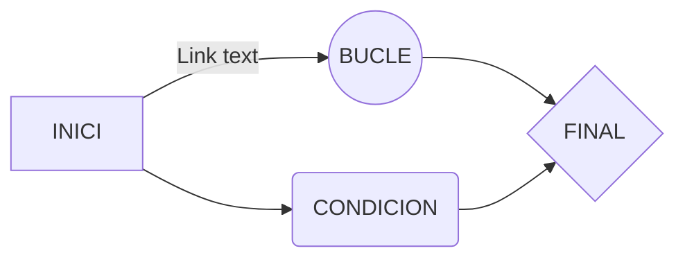

# Welcome to WAN Dylan!

En este markdown iré subiendo los trabajos que e ido haciendo en el curso de 1r de DAW del modulo 1.


# DAW - M01 - Sistemes Informatics

 **Mòdul 1 del Cicle Formatiu de Grau Superior d'Informàtica: Desenvolupament d'Aplicacions Web**

-   El profesor es **JONATAN GIMÉNEZ ELIZONDO**

## Modulos que damos en 1r de DAW

|**DAW** |  |
|--|--|
|**MÓDULOS**|
|**M1**|			Sistemes Informatics|	
|**M2**|  Bases de Dades|
|**M3**|	Programación|		
|**M5**| Entornos de desarrollo|
|**M8**|		Lanzamiento de aplicaciones Web|
|**M10**| FOL|
|**M11**|	EIE|
|**M14**| PHP|


## Poner enlaces
[IEDUCA](https://inscamidemar.ieduca.com/)
[YOUTUBE](https://www.youtube.com/)

## Diagramas


And this will produce a flow chart:


## COMANDAS
```
sudo apt update
```
